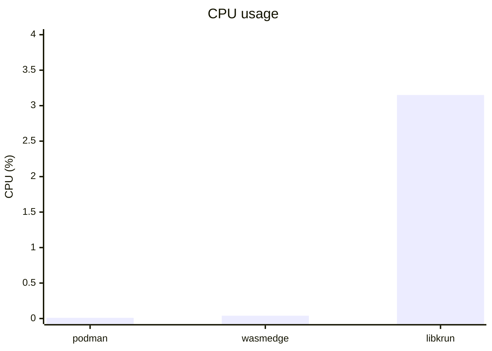
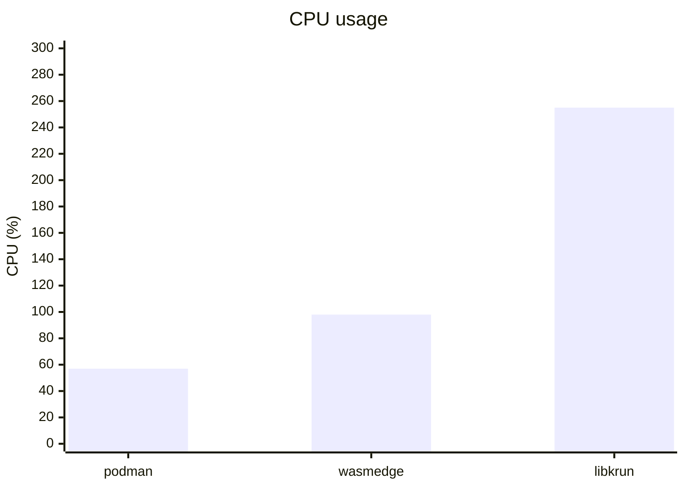
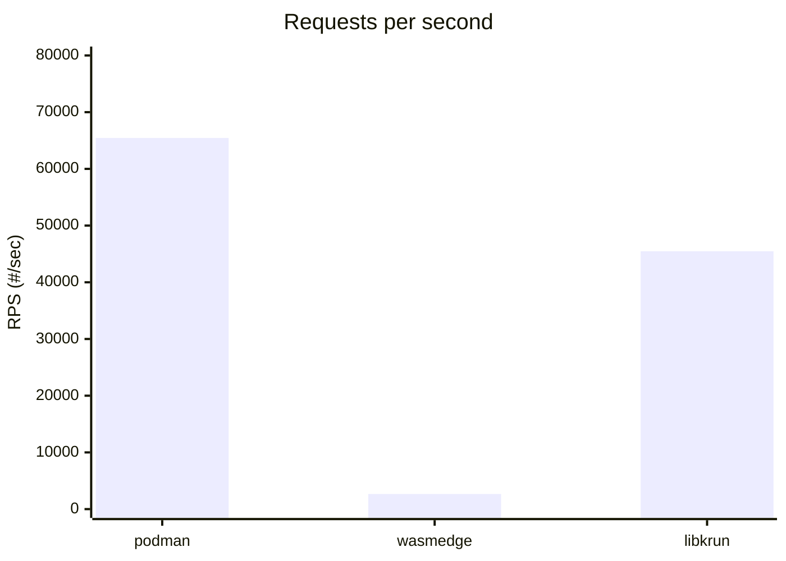
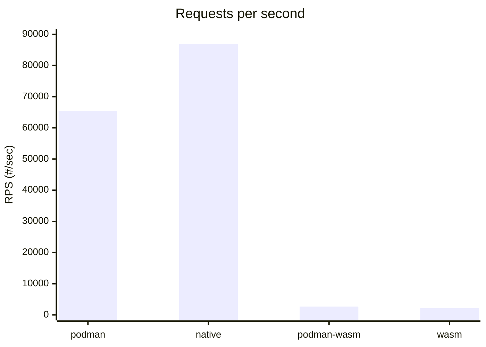

Thanks to [crun](https://github.com/containers/crun) we can run [WebAssembly (Wasm)](#wasm) and [libkrun](#libkrun) workloads in directly in Podman.
```
$ podman info | grep crun -A 2
    name: crun
    package: crun-1.19.1-1.fc41.x86_64
    path: /usr/bin/crun
    version: |-
      crun version 1.19.1
      commit: 3e32a70c93f5aa5fea69b50256cca7fd4aa23c80
      rundir: /run/user/1000/crun
      spec: 1.0.0
      +SYSTEMD +SELINUX +APPARMOR +CAP +SECCOMP +EBPF +CRIU +LIBKRUN +WASM:wasmedge +YAJL
```

## Wasm

WebAssembly (abbreviated Wasm) is a portable binary instruction format. It has gained popularity for its portability as a compilation target that enables deployment on the web for both client and server applications.

We can leverage the portability of Wasm to run Wasm workloads alongside Linux containers by combining crun and Podman. crun supports running Wasm workload by using [WasmEdge](https://wasmedge.org/), [Wasmtime](https://wasmtime.dev/) or [Wasmer](https://wasmer.io/) runtimes. WasmEdge is a lightweight, high-performance, and extensible WebAssembly runtime for cloud-native and edge applications.

To enable Wasm(Edge) applications through Podman in Fedora we need to:
```
$ rpm-ostree install wasmedge crun-wasm
```

To run Wasm applications though Podman:
```
$ podman --runtime /usr/bin/crun-wasm run -dp 8080:8080 --platform=wasi/wasm -t --rm server-with-wasm
```

## libkrun

[libkrun](https://github.com/containers/libkrun) is a dynamic library that allows programs to easily acquire the ability to run processes in a partially isolated environment using KVM Virtualization on Linux and HVF on macOS/ARM64.

It integrates a VMM (Virtual Machine Monitor, the userspace side of an Hypervisor) with the minimum amount of emulated devices required to its purpose, abstracting most of the complexity that comes from Virtual Machine management, offering users a simple C API.


libkrun enables [Confidential Workloads (CW)](https://virtee.io/the-case-for-confidential-workloads/), autonomous, mission specific workloads that run inside a dedicated Virtualization-based TEE. They may make use of a minimal kernel, or have one statically-linked to it (unikernel case), but they shouldn’t depend on any other binary components.

This model is useful to quickly run and deploy small container-based applications, typically with a single container. The driving factor for confidential workloads is quick startup time and reduced resource usage for higher density.

To leverage libkrun through Podman in Fedora we need to:
```
$ rpm-ostree install libkrun
```

To use the libkrun backend though Podman:
```
$ podman run --annotation=run.oci.handler=krun -dp 8080:8080 -t --rm server-without-wasm
```

## Setup

For the comparison, we have used a [Simple Rust HTTP server](https://github.com/josecastillolema/wasmedge-server) from the [WasmEdge Rust SDK examples](https://github.com/second-state/wasmedge-rustsdk-examples) modified to run with and without WasmEdge, running locally on my laptop:
```rust
use std::net::SocketAddr;
use hyper::server::conn::Http;
use hyper::service::service_fn;
use hyper::{Body, Method, Request, Response, StatusCode};
use tokio::net::TcpListener;

/// This is our service handler. It receives a Request, routes on its
/// path, and returns a Future of a Response.
async fn handle_request(req: Request<Body>) -> Result<Response<Body>, hyper::Error> {
    match (req.method(), req.uri().path()) {
        // Serve some instructions at /
        (&Method::GET, "/") => Ok(Response::new(Body::from(
            "Try POSTing data to /echo such as: `curl localhost:8080/echo -XPOST -d 'hello world'`",
        ))),

        // Simply echo the body back to the client.
        (&Method::POST, "/echo") => Ok(Response::new(req.into_body())),

        (&Method::POST, "/echo/reversed") => {
            let whole_body = hyper::body::to_bytes(req.into_body()).await?;

            let reversed_body = whole_body.iter().rev().cloned().collect::<Vec<u8>>();
            Ok(Response::new(Body::from(reversed_body)))
        }

        // Return the 404 Not Found for other routes.
        _ => {
            let mut not_found = Response::default();
            *not_found.status_mut() = StatusCode::NOT_FOUND;
            Ok(not_found)
        }
    }
}

#[tokio::main(flavor = "current_thread")]
async fn main() -> Result<(), Box<dyn std::error::Error + Send + Sync>> {
    let addr = SocketAddr::from(([0, 0, 0, 0], 8080));

    let listener = TcpListener::bind(addr).await?;
    println!("Listening on http://{}", addr);
    loop {
        let (stream, _) = listener.accept().await?;

        tokio::task::spawn(async move {
            if let Err(err) = Http::new().serve_connection(stream, service_fn(handle_request)).await {
                println!("Error serving connection: {:?}", err);
            }
        });
    }
}
```

Dependencies with Wasm support look like:
```toml
[dependencies]
hyper_wasi = { version = "0.15", features = ["full"]}
tokio_wasi = { version = "1", features = ["rt", "macros", "net", "time", "io-util"]}
```

And without:
```toml
[dependencies]
hyper = { version = "0.14", features = ["full"]}
tokio = { version = "1", features = ["rt", "macros", "net", "time", "io-util"]}
```

The [repository](https://github.com/josecastillolema/wasmedge-server) contains instructions to build, run, test and create container images for both scenarios.

## Results

Let's compare "normal" native containers, Wasm(Edge) and libkrun for several scenarios.

### With podman

#### Image size

Wasm image is 77% smaller than the usual container ones. To keep the without-wasm image minimal we have leveraged [musl](https://musl.libc.org/), a minimal C library that is often used on embedded systems and other environments where a full-featured library like glibc is not available.


#### Resource usage


##### Idle

```
$ podman stats
ID            NAME        CPU %       MEM USAGE / LIMIT  MEM %       NET IO      BLOCK IO      PIDS        CPU TIME    AVG CPU %
241deb12adf5  podman      0.01%       208.9kB / 67.1GB   0.00%       0B / 726B   0B / 0B       1           3.915ms     0.01%
a568ddf0f97b  wasmedge    0.04%       26.35MB / 67.1GB   0.04%       0B / 796B   0B / 0B       1           30.242ms    0.04%
f906858667d5  libkrun     3.15%       101.5MB / 67.1GB   0.15%       0B / 656B   0B / 4.096kB  17          901.204ms   3.15%
```

###### CPU

libkrun presents a slightly higher CPU usage (and much more PIDs in use).



###### Memory

Native podman container memory consumption is less than a quarter MB. Wasmedge consumes over 25 MBs (x126) and libkrun over 100 MBs (x487).


##### Under load

```
$ podman stats
ID            NAME        CPU %       MEM USAGE / LIMIT  MEM %       NET IO        BLOCK IO      PIDS        CPU TIME     AVG CPU %
241deb12adf5  podman      57.34%      417.8kB / 67.1GB   0.00%       0B / 1.216kB  0B / 0B       1           13.879976s   0.13%
110f88177027  wasmedge    98.57%      26.6MB  / 67.1GB   0.04%       0B / 656B     0B / 0B       1           6.130282s    27.35%
f906858667d5  libkrun     255.08%     109.1MB / 67.1GB   0.16%       0B / 1.146kB  0B / 4.096kB  17          1m4.485238s  0.66%
```

###### CPU

Native podman containers consume approximately half core. WasmEdge container takes almost a full core. Libkrun consumes over 2.5 cores.




###### Memory

There are no major variations from the memory perspective compared to the idle scenario.


#### Networking performance

To compare networking performance among the three solutions we have used [Drill](https://github.com/fcsonline/drill), a HTTP load testing application written in Rust. The [benchmark file](https://github.com/josecastillolema/wasmedge-server/blob/main/drill-benchmark.yml) can be found in the repository and generates 85 byte HTTP GETs and POSTs calls:
```
$ drill --benchmark drill-benchmark.yml --stats
...
Time taken for tests      44.0 seconds
Total requests            2000000
Successful requests       2000000
Failed requests           0
Requests per second       45475.02 [#/sec]
Median time per request   0ms
Average time per request  0ms
Sample standard deviation 0ms
99.0'th percentile        0ms
99.5'th percentile        0ms
99.9'th percentile        1ms
```

##### Requests per second

The WasmEdge podman container becomes unresponsive after some time. Even so, it only achieves a 4% rate compared with the native podman container solution.



##### Average time per request

The WasmEdge podman container presents the worst latency even delivering only 4% of the request compared with the native container solution.


##### Summary

The **podman** native container solution presented the best overall results as expected.

**libkrun** has great network performance, and incurs in some resource overhead as expected of an hybrid virtualization solution. For networking, it implements `virtio-vsock+TSI`, an experimental mechanism that provides inbound and outbound networking capabilities to the guest, with zero-configuration and minimal footprint, by transparently replacing user-space `AF_INET` sockets with `AF_TSI`, implementing both `AF_INET` and `AF_VSOCK` sockets. TSI has the additional advantage that, for the host side, all connections appear to come and go to the process acting as a VMM, which makes it very container-friendly in a way that even side-cars (such as Istio) work out-of-the-box.

The **WasmEdge** solution presents a very acceptable resource consumption (and the best image size), however the networking performance is only a 4% compared to native podman and the application becomes unresponsive under heavy load.


### Without podman

Wasm is often described as having "near-native performance". Let's remove podman from the equation to see if we observe a better networking performance.

#### Wasmedge

To build locally the WasmEdge enabled served:
```
$ rustup target add wasm32-wasi
$ cargo build --target wasm32-wasi --release
```

Run the Wasm bytecode file in WasmEdge CLI.

```
$ wasmedge target/wasm32-wasi/release/server-with-wasm.wasm
Listening on http://0.0.0.0:8080
```

And run the test:
```
$ drill --benchmark drill-benchmark.yml --stats
...
Time taken for tests      91.4 seconds
Total requests            200000
Successful requests       200000
Failed requests           0
Requests per second       2188.77 [#/sec]
Median time per request   5ms
Average time per request  5ms
Sample standard deviation 2ms
99.0'th percentile        9ms
99.5'th percentile        10ms
99.9'th percentile        10ms
```

While the server did not become unresponsive and sustained a longer test, the RPS result is similar to the podman one.

#### Native

Compile the Rust server source code:
```
$ rustup target add x86_64-unknown-linux-musl
$ cargo build --target x86_64-unknown-linux-musl --release
```

Run the server:

```
$ ./target/x86_64-unknown-linux-musl/release/server-without-wasm
Listening on http://0.0.0.0:8080
```

And run the test:
```
$ drill --benchmark drill-benchmark.yml --stats
...
Time taken for tests      23.0 seconds
Total requests            2000000
Successful requests       2000000
Failed requests           0
Requests per second       86970.22 [#/sec]
Median time per request   0ms
Average time per request  0ms
Sample standard deviation 0ms
99.0'th percentile        0ms
99.5'th percentile        0ms
99.9'th percentile        0ms
```

We observe some podman overhead (approximately 30%).

#### Summary

Podman is not responsible for the poor networking performance of the Wasmedge enabled server.



Looking at this nice article about the [Performance of WebAssembly runtimes in 2023](https://00f.net/2023/01/04/webassembly-benchmark-2023/) it does not look that Wasmedge is a slow runtime compared to the median performance. If you’re looking for the best performer, looks like [iwasm](https://github.com/bytecodealliance/wasm-micro-runtime) is currently the one to choose, but overall Wasmtime, WasmEdge and Wasmer (supported by crun) are in the same ballpark and have a decent performance.

A quick look at the `wasmedge` CLI options shows an option that could be of interest for this particular use case, however no significant performance improvement was observed with it:
```
$ wasmedge -h
...
--enable-threads
                Enable Threads proposal
...
```

#### Profiling

At this point, the performance hit looks to be due to 1) the Wasm runtime or 2) the Wasm ported libraries (`hyper_wasi` and `tokio_wasi`). Let's take a closer look using flame graphs.

To profile a release build effectively we need to enable source line debug info. To do this, add the following lines to the `Cargo.toml` file:
```toml
[profile.release]
debug = 1
```

Build and run again the server, clone the [FlameGraph repository](https://github.com/brendangregg/FlameGraph) and for convenience put it on your path:
```
$ perf record -F 99 -p [pid of server-with-wasm] --call-graph dwarf -- curl localhost:8080
$ perf script > server-with-wasm.perf
$ stackcollapse-perf.pl server-with-wasm.perf > server-with-wasm.folded
$ flamegraph.pl server-with-wasm.folded > server-with-wasm.sv
```

This is the resulting flame graph. It looks like most of the time is spent on `libwasmedge.so` calls:
